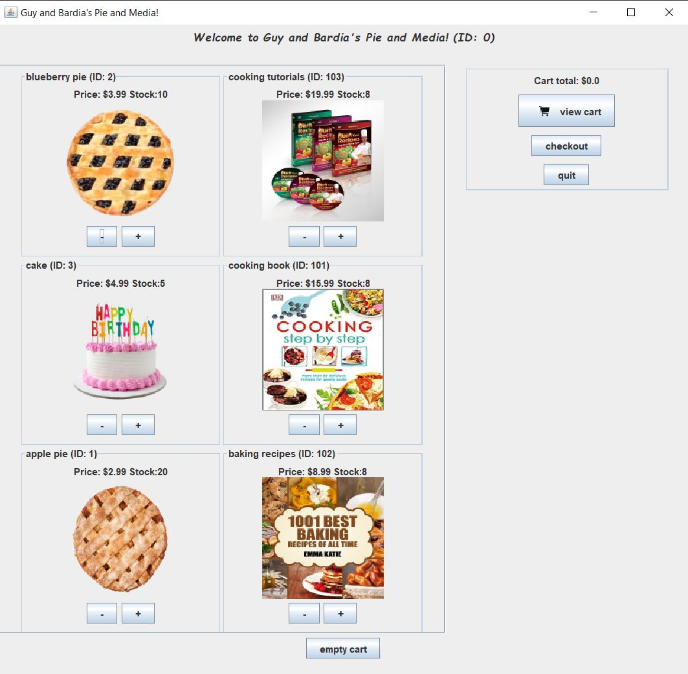
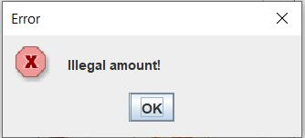
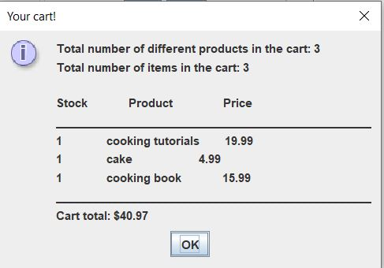
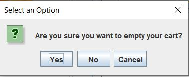
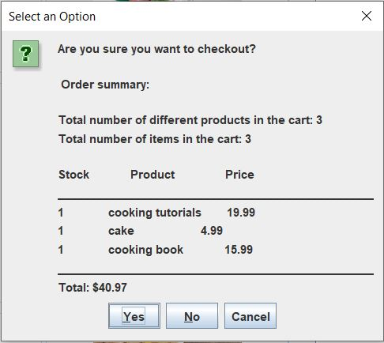
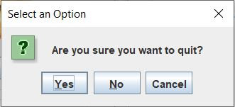
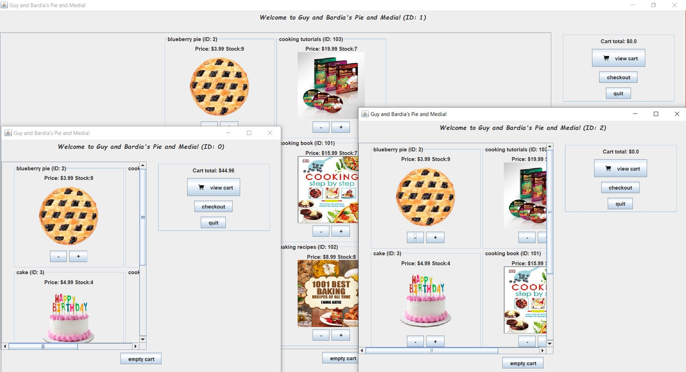

# Virtual Store

by Bardia Parmoun and Guy Morgenshtern

Released on: 2/05/2021

## DESCRIPTION
- This program simulates a virtual cooking store.
- Each client can choose from the available items and at the end the program will generate a receipt for them.
- It can support different number of clients (the default number is 3)

## RUNNING THE PROGRAM
- Note that you need to have java installed on your computer in order to run the program. The latest version of JDK can 
be found here: https://adoptopenjdk.net/releases.html
- To run the program you can use either use StoreView or StoreViewBatchUI:
- You need to compile the program:

Locate the mystore folder and inside of that run the following command: 
```shell
$ javac @sources.txt
```
Then exit the folder and run either of the follwing commands to access the UIs:
```shell
$ java mystore/StoreView
```
or
```shell
$ java mystore/StoreViewBatchUI
```

If you want to run the already compiled version of the code you can run the jar file by simply clicking on it or run it using:
```shell
$ java -jar VirtualStore.jar
```
## USING THE PROGRAM
- After running StoreView you will prompted by the following window:
<p align="center">
The main window for the program

</p>

- You can add and remove any item to your cart by clicking either the + or but if you try to add or remove an illegal you will be prompted with the following error message: 
<p align="center">

</p>

- You can view the items in your cart by clicking the View Cart button:
<p align="center">
An example of the message displayed by view cart

</p>

- You can also empty you cart at any time using the empty cart button which displays the following message:
<p align="center">

</p>

- Once you are done shopping you can click the checkout button which displays a receipt of your purchase for you to confirm:
<p align="center">

</p>

- You can quit the store at any time by clicking the quit button which empties your cart and returns all of its contents to the inventory. Clicking the quit button results in the following message:
<p align="center">

</p>

- Notice that once you start the program the number of stores is set to 3 by default which opens 3 stores at once. You can treat these windows as 3 separate clients and work on each one individually. Note that once you switch between the stores the content of their inventories will be updated according to your last actions. You can also resize the windows for easier use!
<p align="center">

</p>

## CREDITS
Author: Bardia Parmoun & Guy Morgenshtern

Copyright © 2021 Bardia Parmoun Guy Morgenshtern. All rights reserved
